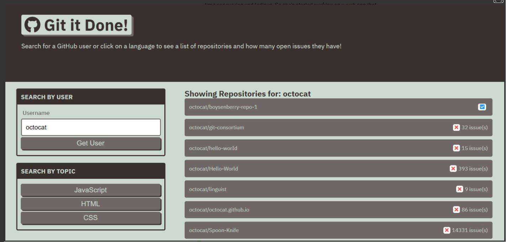

# git-it-done

## Purpose
To provide the user with a since source for searching a given GitHub user's repositories and displaying the associated issues

## Features
When the user launches the website, they are provided with the ability to search for GitHub repositories by username or language type. The search results will display whether there are open issues in a project, allowing the user to determine whether or not they can potentially help contribute to the creator's efforts.

## Website
https://jennifermulder.github.io/git-it-done/

## Built With
* HTML
* CSS
* JavaScript
* Node JS 
* Express
* Server Side APIs

## Project Status
The GitHub search site is compliant with defined acceptance criteria

## Contribution
Created by Jennifer Mulder

